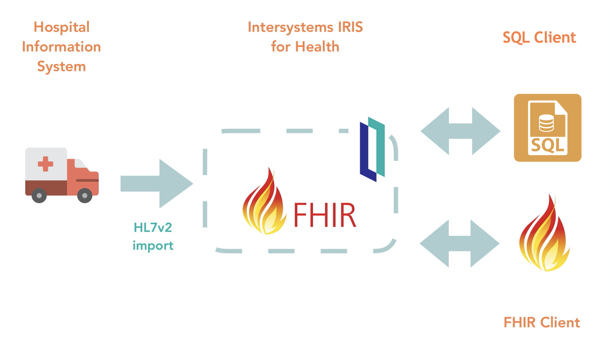
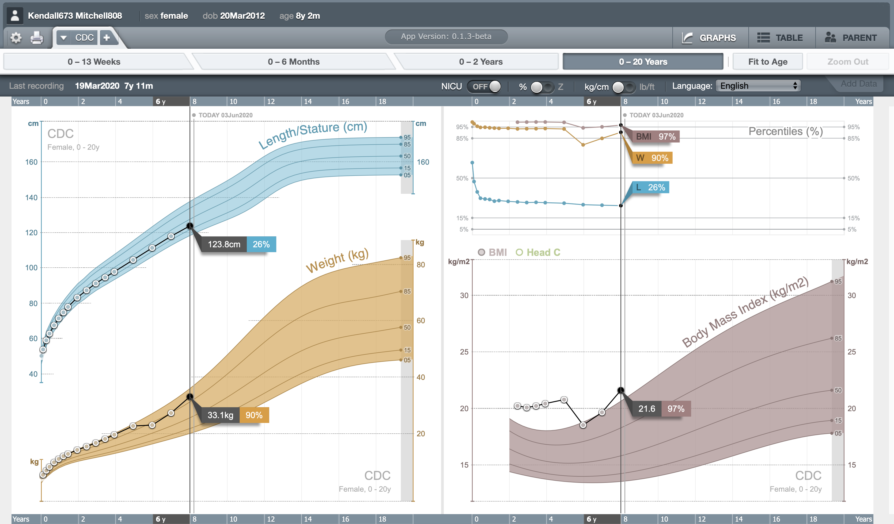

Este repositorio contiene los ejemplos y las instrucciones para el Webinar - Comienza a trabajar con FHIR. 


# ¿Qué necesitas?
* [Docker](https://www.docker.com/products/docker-desktop) - para ejecutar [IRIS for Health Community](https://www.intersystems.com/products/intersystems-iris-for-health/).
* [Postman](https://www.postman.com/downloads/) - para lanzar peticiones REST.

# Repositorio FHIR
Construiremos un repositorio de recursos [FHIR R4](https://www.hl7.org/fhir/) utilizando las funcionalidades de [FHIR Server](https://docs.intersystems.com/irisforhealth20202/csp/docbook/DocBook.UI.Page.cls) de la nueva [preview 2020.2 de IRIS for Health](https://es.community.intersystems.com/post/versiones-de-prueba-de-intersystems-iris-e-iris-health-20202). 

## Instalación FHIR Server
1. Descarga el repositorio
```shell
git clone https://github.com/es-comunidad-intersystems/webinar-fhir
cd webinar-fhir
```

2. Inicia la instancia [IRIS for Health](https://www.intersystems.com/products/intersystems-iris-for-health/)
```shell
docker-compose up
```

3. Con la instancia en marcha, podrás acceder al [Mng. Portal](http://localhost:52773/csp/sys/UtilHome.csp)
* Usuario: `superuser`
* Password: `SYS`
4. Abre una sesión interactiva utilizando [WebTerminal](http://localhost:52773/terminal/)

5. Creamos un namespace *foundation* donde instalaremos el *FHIR Server* que configuraremos como repositorio FHIR.
```objectscript
zn "HSLIB"
do ##class(HS.HC.Util.Installer).InstallFoundation("FHIRNamespace")
zn "FHIRNamespace"
```

## Configuración
Configuraremos nuestro *FHIR Server* para que actúe como un repositorio FHIR R4.

Utilizaremos la *UI* aunque también podemos hacerlo de forma prográmatica.

Accede a [Mng. Portal > Health > FHIRNamespace](http://localhost:52773/csp/healthshare/fhirnamespace/HS.HC.UI.Home.cls), haz click en **FHIR Configuration**, y añade un nuevo *endpoint*:
* Metadata Set: `HL7v40`
* Interaction Stragegy: `HS.FHIRServer.Storage.Json.InteractionStrategy`
* Name: `/csp/healthshare/fhirnamespace/fhir/r4`

Después de añadirlo, editamos su configuración y habilitamos la opción de *Debugging* `Allow Unauthenticated Access` para poder realizar pruebas fácilmente.

## Pruebas simples
Vamos a ejecutar unas pruebas sencillas en el *endpoint* FHIR R4 que acabamos de crear.

Importa en **Postman** la colección [IRIS FHIRServer.postman_collection.json](IRIS%20FHIRServer.postman_collection.json).

Echa un vistazo a las peticiones bajo el directorio *Simple*. Si las ejecutas en orden te permitirán:
* Ver el *Capability Statement* del *FHIR Server*.
* Crear un paciente.
* Obtener el paciente creado.
* Modificar un paciente.
* Crear una observación clínica.
* Obtener una versión específica del paciente (antes de la modificación).
* Consultar observaciones.
* Consultar pacientes.
* Consultar pacientes por distintos criterios.

# Cargar datos de ejemplo
En el directorio `fhir` se incluyen algunos ejemplos de datos realistas que se han generado con la herramienta [Synthea](https://github.com/synthetichealth/synthea).

Vamos a cargar los ficheros con datos generados en IRIS utilizando `HS.FHIRServer.Tools.DataLoader` utilizando de nuevo unas sesión de [WebTerminal](http://localhost:52773/terminal/):
```objectscript
do ##class(HS.FHIRServer.Tools.DataLoader).SubmitResourceFiles("/app/fhir/","FHIRServer","/csp/healthshare/fhirnamespace/fhir/r4")
```

Echemos un vistazo a alguno de los ficheros FHIR como [este ejemplo](fhir/Augustine565_Wolf938_dac83fee-ea24-4a2c-975d-3e0cd95a395f.json) y comprueba los *resources* que contiene: [Bundle](https://www.hl7.org/fhir/bundle.html), [Patient](https://www.hl7.org/fhir/patient.html), [Practitioner](https://www.hl7.org/fhir/practitioner.html), [Organization](https://www.hl7.org/fhir/organization.html), [CareTeam](https://www.hl7.org/fhir/careteam.html), [CarePlan](https://www.hl7.org/fhir/careplan.html), [Claim](https://www.hl7.org/fhir/claim.html), [Coverage](https://www.hl7.org/fhir/coverage.html), [ExplanationOfBenefit](https://www.hl7.org/fhir/explanationofbenefit.html), [Encounter](https://www.hl7.org/fhir/encounter.html), [AllergyIntolerance](https://www.hl7.org/fhir/allergyintolerance.html), [Condition](https://www.hl7.org/fhir/condition.html), [Goal](https://www.hl7.org/fhir/goal.html), [Observation](https://www.hl7.org/fhir/observation.html), etc.

La lista completa de recursos disponibles en FHIR R4 está disponible [aquí](https://www.hl7.org/fhir/resourcelist.html).

Los pacientes generados que vamos a cargar son:
```
7 -- Kendall673 Mitchell808 (8 y/o F) Shutesbury, Massachusetts 
2 -- Augustine565 Cremin516 (8 y/o F) Worcester, Massachusetts 
6 -- Hayden835 Kunde533 (29 y/o M) Taunton, Massachusetts 
4 -- Linwood526 Jones311 (30 y/o M) Billerica, Massachusetts 
5 -- Lizbeth716 Harvey63 (44 y/o F) Boston, Massachusetts DECEASED
8 -- Rhett759 Mosciski958 (65 y/o M) Woburn, Massachusetts DECEASED
3 -- Marlyn309 Orn563 (56 y/o F) Malden, Massachusetts 
1 -- Mariano761 Gulgowski816 (53 y/o M) North Reading, Massachusetts 
9 -- Jordan900 Zieme486 (2 y/o M) Gloucester, Massachusetts 
10 -- Elisha578 Willms744 (63 y/o M) Brookline, Massachusetts 
8 -- Shawn523 Lehner980 (74 y/o M) Woburn, Massachusetts 
5 -- Alfreda3 Lemke654 (74 y/o F) Boston, Massachusetts 
{alive=10, dead=2}
```

# Consultar datos generados
A continuación podemos ejecutar algunas consultas sobre los datos que acabamos de importar.

Volvemos a **Postman**, y vamos a la carpeta *Queries* de la colección [IRIS FHIRServer.postman_collection.json](IRIS%20FHIRServer.postman_collection.json).
* Concentración de [potasio](https://loinc.org/6298-4/) o [glucosa](https://loinc.org/2339-0/) por encima de cierto nivel.
* Observaciones clínicas de un paciente en concreto.
* Visitas ambulatorias por bronquitis agudas 
* Obtener toda la información disponible de un paciente.

Echa un vistazo directamente en SQL a los datos en el [Explorador SQL](http://localhost:52773/csp/sys/exp/%25CSP.UI.Portal.SQL.Home.zen?$NAMESPACE=FHIRNAMESPACE):
```sql
-- recursos que se han creado
select * from HSFHIR_I0001_R.Rsrc
```

```sql
-- tabla de búsqueda para pacientes
select * from HSFHIR_I0001_S.Patient order by birthdate desc
```

# Debugging
Nuestro servidor de pruebas, tenía ya activado el *Unauthenticated Access* para poder probar más fácilmente. Podemos además añadir varias opciones de [Debugging](https://docs.intersystems.com/irisforhealth20202/csp/docbook/Doc.View.cls?KEY=HXFHIR_server_debugMaintain#HXFHIR_server_debug).

## Log interno
Vamos a activar el debugging interno del FHIR Server en la sesión de [WebTerminal](http://localhost:52773/terminal/):
```objectscript
set ^FSLogChannel("all") = 1
```

A continuación, podemos ver el log a través del visor de globals:
[Mng. Portal > System Explorer > Globals (FHIRNAMESPACE) > FSLOG](http://localhost:52773/csp/sys/exp/UtilExpGlobalView.csp?$ID2=FSLOG&$NAMESPACE=FHIRNAMESPACE)

Utilizando este log podemos determinar exactamente la query SQL que se construye.

## Log HTTP
Podemos tambien activar el log HTTP para analizar las peticiones al FHIR Server. Lo activamos de esta forma:
```objectscript
set ^%ISCLOG=5 
set ^%ISCLOG("Category","HSFHIR")=5 
set ^%ISCLOG("Category","HSFHIRServer")=5
```

Y consultamos la información del log aquí:
[Mng. Portal > System Explorer > Globals (%SYS) > ISCLOG](http://localhost:52773/csp/sys/exp/UtilExpGlobalView.csp?$ID2=ISCLOG&$NAMESPACE=%SYS)

# HL7 a FHIR
InterSystems incluye [transformaciones](https://docs.intersystems.com/irisforhealth20202/csp/docbook/Doc.View.cls?KEY=HXFHIR_transforms) que convierten objetos SDA en recursos FHIR y viceversa.

[SDA](https://docs.intersystems.com/irisforhealth20202/csp/docbook/Doc.View.cls?KEY=HXSDA) es un formato clínico intermedio que facilita la transformación de un estándar en otro. 

Un caso de uso típico es transformar mensajes HL7 en recursos FHIR. Con las transformaciones incluidas se puede hacer de forma HL7-SDA-FHIR.

Además, puedes consultar cómo se consideran los campos HL7 y los recursos FHIR a la otra de transformar hacia o desde SDA en [Health > FHIRNamespace > Schema Documentation](http://localhost:52773/csp/healthshare/fhirnamespace/HS.HC.UI.Home.cls).

Un ejemplo muy sencillo de cómo hacerlo lo encontramos en la aplicación [FHIR-HL7v2-SQL-Demo](https://openexchange.intersystems.com/package/FHIR-HL7v2-SQL-Demo).



# SMART
Vamos a probar una de las aplicaciones más conocidas de la [SMART App Gallery](https://gallery.smarthealthit.org) de forma que se alimente de los datos que tenemos almacenados en nuestro *FHIR Server*.

La aplicación [Growth Chart](https://github.com/smart-on-fhir/growth-chart-app) permite representar el crecimiento de un niño a lo largo del tiempo. 

La aplicación ya está ejecutándose en uno de los [contenedores](docker-compose.yml) del webinar en modo de pruebas, para poder probarla rápidamente.

Para probarla necesitamos simplemente invocarla pasando el endpoint de nuestro *FHIRServer* y el paciente a consultar:

http://localhost:9000/launch.html?iss=http://localhost:52773/csp/healthshare/fhirnamespace/fhir/r4&patientId=1152

Puedes volver a consultar los pacientes disponibles y probar con diferentes registros.



Si estás interesado en las aplicaciones SMART on FHIR échale un vistazo a [Building SMART on FHIR Apps with InterSystems FHIR Sandbox](https://learning.intersystems.com/course/view.php?id=964) donde podrás aprender a desarrollar una aplicación simple.
