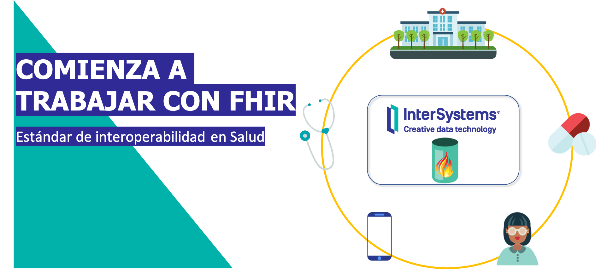

Este repositorio contiene los ejemplos y las instrucciones para el Webinar - Comienza a trabajar con FHIR. 



# ¿Qué necesitas?
* [Docker](https://www.docker.com/products/docker-desktop) - para ejecutar [IRIS for Health Community](https://www.intersystems.com/products/intersystems-iris-for-health/).
* [Postman](https://www.postman.com/downloads/) - para lanzar peticiones REST.

# REPOSITORIO FHIR
## Instalación
1. Descarga el repositorio
```shell
git clone https://github.com/es-comunidad-intersystems/webinar-fhir
cd webinar-fhir
```

2. Inicia la instancia [IRIS for Health](https://www.intersystems.com/products/intersystems-iris-for-health/)
```shell
docker-compose up
```

3. Con la instancia en marcha, podrás acceder al [Mng. Portal](http://localhost:52773/csp/sys/UtilHome.csp)
* Usuario: `superuser`
* Password: `SYS`

4. Abre una sesión interactiva utilizando [WebTerminal](http://localhost:52773/terminal/)

5. Creamos un namespace *foundation* donde instalaremos el *FHIR Server* que configuraremos como repositorio FHIR.
```objectscript
zn "HSLIB"
do ##class(HS.HC.Util.Installer).InstallFoundation("FHIRNamespace")
zn "FHIRNamespace"
```

## Configuración
Configuraremos nuestro *FHIR Server* para que actúe como un repositorio FHIR R4.

Utilizaremos la *UI* aunque también podemos hacerlo de forma prográmatica.

Accede a [Mng. Portal > Health > FHIRNamespace](http://localhost:52773/csp/healthshare/fhirnamespace/HS.HC.UI.Home.cls), haz click en **FHIR Configuration**, y añade un nuevo *endpoint*:
* Metadata Set: `HL7v40`
* Interaction Stragegy: `HS.FHIRServer.Storage.Json.InteractionStrategy`
* Name: `/csp/healthshare/fhirnamespace/fhir/r4`

Después de añadirlo, editamos su configuración y habilitamos la opción de *Debugging* `Allow Unauthenticated Access` para poder realizar pruebas fácilmente.

## Pruebas simples
Vamos a ejecutar unas pruebas sencillas en el *endpoint* FHIR R4 que acabamos de crear.

Importa en **Postman** la colección [IRIS FHIRServer.postman_collection.json](IRIS%20FHIRServer.postman_collection.json).

Echa un vistazo a las peticiones bajo el directorio *Simple*. Si las ejecutas en orden te permitirán:
* Ver el *Capability Statement* del *FHIR Server*.
* Crear un paciente.
* Obtener el paciente creado.
* Modificar un paciente.
* Crear una observación clínica.
* Obtener una versión específica del paciente (antes de la modificación).
* Consultar observaciones.
* Consultar pacientes.
* Consultar pacientes por distintos criterios.

# TODO. Clases
Diagrama herencia
HS.FHIRServer.Storage.Json.InteractionsStrategy
HS.FHIRServer.Storage.Json.Interactions

# Cargar datos FHIR (Synthea)
Echemos un vistazo a alguno de los ficheros FHIR como [este ejemplo](fhir/Alecia465_Hills818_4c93d4af-e649-4646-8c28-6d4f14c489b3.json) y comprueba los *resources* que contiene: Bundle, Encounter, AllergyIntolerance, Claim, Organization, Practitioner, etc.

Los datos del directorio `fhir/` han sido generados con [Synthea](https://github.com/synthetichealth/synthea) utilizando el comando:
```console
$ ./run_synthea -s 12345 -p 50
```

Vamos a cargar los ficheros con datos generados en IRIS utilizando `HS.FHIRServer.Tools.DataLoader`:
```
set status = ##class(HS.FHIRServer.Tools.DataLoader).SubmitResourceFiles("/app/fhir/","FHIRServer","/csp/healthshare/fhirnamespace/fhir/r4")
```

# TODO: Consultar datos generados
Ejemplos de queries más complejas (contains, encounters, etc.)


# TODO: utilización de operaciones
TODO: hablar de cómo implementar operaciones en FHIR Server

# Debugging
```objectscript
set ^FSLogChannel("all") = 1
```

[Mng. Portal > System Explorer > Globals (FHIRNAMESPACE) > FSLOG](http://localhost:52773/csp/sys/exp/UtilExpGlobalView.csp?$ID2=FSLOG&$NAMESPACE=FHIRNAMESPACE)


```objectscript
set ^%ISCLOG=5 
set ^%ISCLOG("Category","HSFHIR")=5 
set ^%ISCLOG("Category","HSFHIRServer")=5
```

[Mng. Portal > System Explorer > Globals (%SYS) > ISCLOG](http://localhost:52773/csp/sys/exp/UtilExpGlobalView.csp?$ID2=ISCLOG&$NAMESPACE=%SYS)


# SMART
```
git clone https://github.com/smart-on-fhir/growth-chart-app
npm install
npm start
```

## Growth chart

http://localhost:9000/launch.html?fhirServiceUrl=http://launch.smarthealthit.org/v/r3/fhir
launch.html -> patientId: smart-1137192

http://localhost:9000/launch.html?fhirServiceUrl=http://localhost:52773/csp/healthshare/fhirnamespace/fhir/r4
launch.html -> patientId: 1

http://localhost:9000/launch.html?iss=http://localhost:52773/csp/healthshare/fhirnamespace/fhir/r4&patientId=3
launch.html modificado

```
<script>
    var url = new URL(window.location.href);
    var patientId = url.searchParams.get("patientId");
    
    FHIR.oauth2.authorize({
    "client_id": "growth_chart",
    "patientId": patientId,
    "scope":  "patient/Observation.read patient/Patient.read offline_access",
    // "client_id": "944d96a0-4caf-4a96-813e-bc38aadb1169" // HSPC
    // "client_id": "5570f8be-6caf-4915-ae15-69545ab38e68" // Cerner
    });
</script>
```
Adela471 Pfeffer420 tiene datos
